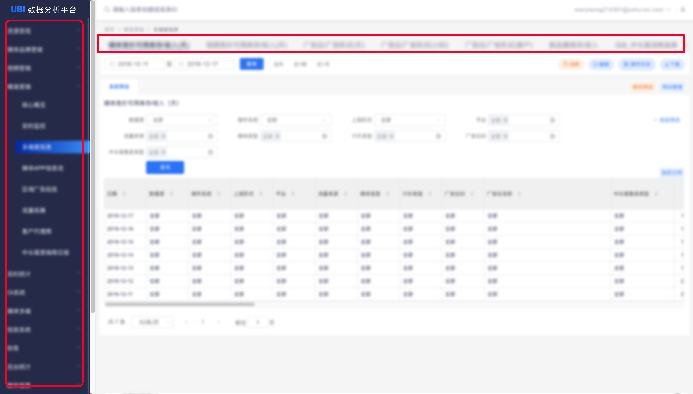

# 进入报表

## 左侧导航&报表TAB 

点击系统首页链接[http://visual.sohu-inc.com/](http://visual.sohu-inc.com/)或报表链接，登陆公司邮箱账号，直接进入系统或报表中

点击导航菜单&主内容区报表TAB，进入相关报表页面；可点击箭头，翻页查看报表TAB

## 报表搜索 

当权限下报表数量过多时，可通过“报表搜索”直接进入报表

#### 操作方法

1. 点击页面顶部搜索框
2. 输入报表标题关键词或报表ID，下拉菜单中查看搜索结果
3. 下拉菜单中，点击所找的“报表”，进入报表

**报表ID是什么？：**


“报表ID”由3-4位数字构成，可于**浏览器地址栏最末字段**、**报表搜索下拉菜单**、**首页最近访问**中查看 


## 最近访问 

UBI首页“最近访问“中，展示最近10条报表访问记录

可直接点击“报表名称”或“查看”，进入报表

