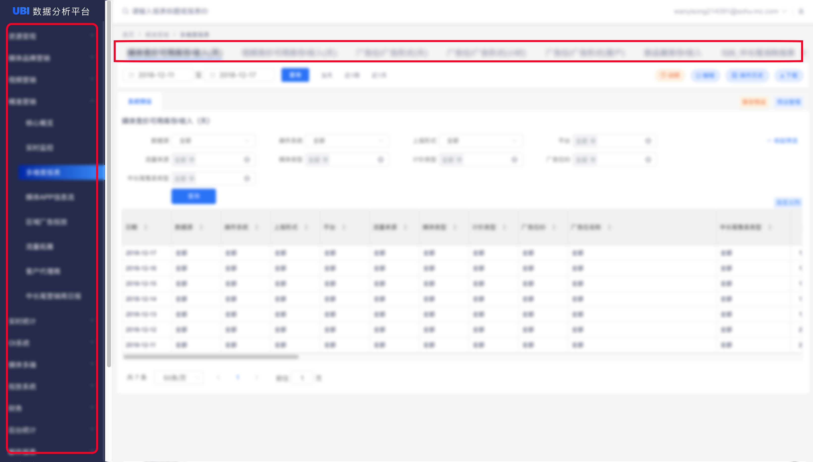

# 样式测试

## 一级标题-文字样式测试

### 二级标题

#### 三级标题

我是正文；**我是正文加粗**；_我是正文倾斜；_~~_我是正文划线_~~

## `BUllet&Orderlist`&TASK

* bullet测试
* bullet测试
* bullet测试
  * bullet测试
  * bullet测试

1. Orderlist测试
2. Orderlist测试
   1. Orderlist测试，不能缩进
   2. Orderlist测试，不能缩进

* [ ] Task测试
* [ ] Task测试

## CODE样式

```text
Code测试
```

## Quote样式

> Quote测试 Quote测试
>
> > Quote测试

## 



## 

## 表格样式

| 表格 | 🤩 emoji测试 | Emoji | 1 | 上线时间 | 圣诞节干点啥 |
| :--- | :--- | :--- | :--- | :--- | :--- |
| 表格 | 123 | ABC |  | 2018年12月25日 | 🎄 |

## Hint样式


注意事项，筛选控件清空时，点击查询按钮，会自动按照“预设默认值”查询数据，筛选控件清空时会自动按照默认值查询



注意事项，筛选控件清空时，点击查询按钮，会自动按照“预设默认值”查询数据，筛选控件清空时会自动按照默认值查询



注意事项，筛选控件清空时，点击查询按钮，会自动按照“预设默认值”查询数据，筛选控件清空时会自动按照默认值查询



注意事项，筛选控件清空时，点击查询按钮，会自动按照“预设默认值”查询数据，筛选控件清空时会自动按照默认值查询


## Page Link 页面链接测试





## API-样式

























```

```





## 自定义Tab样式



## 一级标题

段落描述

* Bullet测试Bullet测试
* Bullet测试
  * Bullet测试Bullet测试







## TAB中-一级标题

### TAB-二级标题




